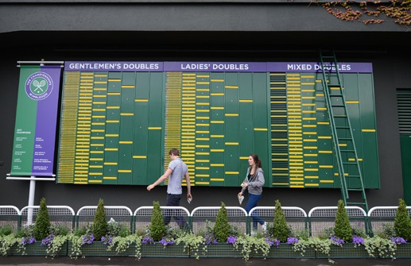

```{r setup, include=FALSE}
knitr::opts_chunk$set(echo = FALSE)
```


## Overview

- The competition
- Organisation
- How did we do?
- What did we learn?

## Who are Mango?

<div class="double">
- Data Science Consultancy based in Chippenham
- About 45 people. Mix of:
    * Data Scientists
    * Data Engineers
    * Java Devs
- Lots of R and Python
- Meetups ([Bristol Data Science](http://www.meetup.com/Bristol-Data-Scientists/), [LondonR](http://www.londonr.org))

</p><p class="double-flow">

</p>

## Who was the Team?

- 4 Summer interns (2nd-4th year UGs)
- 1 Industry placement student
- 3 New starters
- 2 Senior consultants

## Kaggle Competition { .cover }


## Organisation { .cover }


## How did we do? { .cover .white }



## What did we learn? { .cover }


