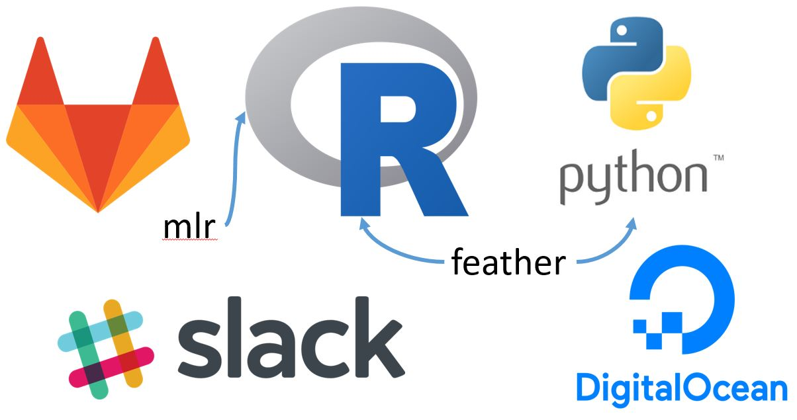

```{r setup, include=FALSE}
knitr::opts_chunk$set(echo = FALSE)
```


## Overview

- The competition
- Organisation
- How did we do?
- What did we learn?

## Who are Mango?

<div class="double">
<p class="double-flow">
- Data Science Consultancy based in Chippenham
- About 45 people. Mix of:
    * Data Scientists
    * Data Engineers
    * Java Devs
- Lots of R and Python
- Meetups ([Bristol Data Science](http://www.meetup.com/Bristol-Data-Scientists/), [LondonR](http://www.londonr.org))

</p><p class="double-flow">

</p>
</div>

## Who was the Team?

<div class="double">
<p class="double-flow">
- 4 Summer interns (2nd-4th year UGs)
- 1 Industry placement student
- 3 New starters
- 2 Senior consultants
</p><p class="double-flow">

</p>
</div>

## Kaggle Competition { .cover }


## Talking Data

[https://www.kaggle.com/c/talkingdata-mobile-user-demographics](https://www.kaggle.com/c/talkingdata-mobile-user-demographics)


## Organisation { .cover .white}


## Organisation

<div class="double">
<p class="double-flow">
### Centralised

- Conform around one code base
- Protected master branch
- Peer review
- Can be frustrating

### &#x2714;

</p><p class="double-flow">
### Decentralised

- Market based approach
- Steal from each other's code
- Cf. Kaggle kernels
- Can lead to repitition

### &#x2714;

</p>
</div>

## Organisation

<div class="double">
<p class="double-flow">
### Agile

- Get it end-to-end quickly
- Iterate

### &#x2714;

</p><p class="double-flow">
### Waterfall

- Plan phases
- Comes together at the end

### &#x2718;

</p>
</div>

## Repo { .cover }


## Single Repository

`CONTRIBUTING.md`

```
|- talking-data
    |- data
        |- raw
        |- clean
        |- features
        |- prepared
    |- library
    |- scripts
    |- output
```

## Other Tech



<center>[https://github.com/wesm/feather](https://github.com/wesm/feather)</center>

## How did we do? { .cover .white }


## How did we do?

### Meh.

## How did we do?

### Meh.

- Mid-table finish
- Ran out of time

### :-)

- No kernels!
- It was reproducible

## Reproducible Research

> From the same raw data someone else should be able to reproduce your results on their computer.

<div class="double">
<p class="double-flow">

### Version 1

- Script
- Supporting package (library)

</p><p class="double-flow">

### Version 2

- Makefile (or remake)
- Supporting package (library)

</p>
</div>

## Reproducible Pipelines

<div class="double">
<p class="double-flow">

### GNU Make

- Everyone's got it
- Mix R any Python (+1 for feather)

</p><p class="double-flow">

### remake / snakemake

- Objects as targets
- [https://github.com/richfitz/remake](https://github.com/richfitz/remake)

</p>
</div>


## What did we learn? { .cover }


## What did we learn?

<div class="double">
<p class="double-flow">

### The bad

- Git is hard
- Centralising can be slow

</p><p class="double-flow">

### The good

- Reproducible results
- Learned lots from each other

</p>
</div>

## Keep in touch

- [Twitter @dougashton]()
- [GitHub - dougmet]()
- Email: dashton@mango-solutions.com

Talk to me about data science jobs/internships/placements
